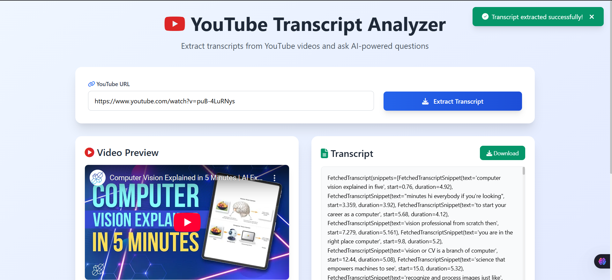
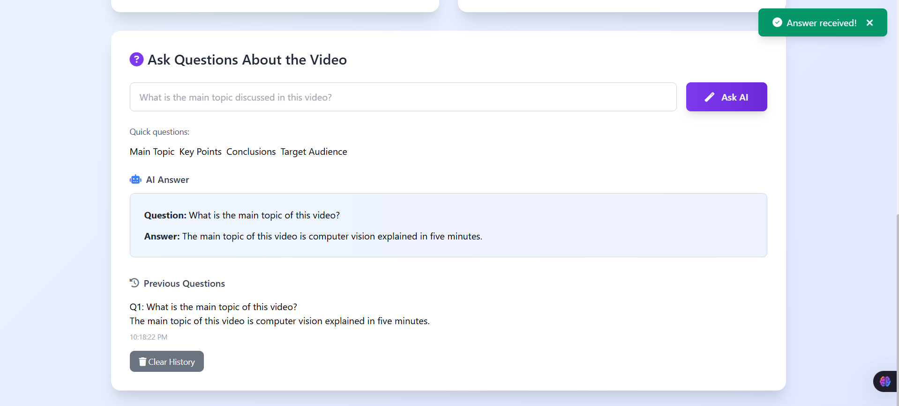

# 🎬 YouTube Transcript AI

> 🚀 Paste a YouTube link → Get the transcript → Ask any question → Get an AI-powered answer.  
> Built with FastAPI, OpenAI GPT, and `youtube-transcript-api`.

---

## ✨ Features

- 📼 Fetches YouTube video transcripts even if captions aren't manually uploaded
- ❓ Asks questions about transcripts using GPT-3.5/4 (via OpenAI API)
- ⚡ FastAPI backend with full API error handling
- 🌐 Static frontend (`index.html`, `styles.css`, `script.js`) served with the app
- 🚀 Deploy-ready for platforms like **Render**

---

## 📁 Project Structure
```
.
├── main.py                 # FastAPI app with routes and logic
├── static/
│   ├── index.html          # Frontend HTML
│   ├── styles.css          # Custom CSS
│   └── script.js           # Frontend JS logic
├── requirements.txt        # Python dependencies
├── .env                    # Environment variables (not committed)
└── README.md               # This file

```

---

## 🌐 Demo / Interface Preview

> 🔽 Add your screenshots or GIFs here manually by uploading them to GitHub or linking from `/assets/`.

### Example:


*Paste a YouTube URL*


*Ask questions and get answers from OpenAI*

---

## 🧪 Local Development

### 1. Clone the Repo

```bash
git clone https://github.com/yourusername/youtube-transcript-ai.git
cd youtube-transcript-ai
```
### Set Up a Virtual Environment
```
python -m venv venv
venv\Scripts\activate
```

### Install Dependencies
```
pip install -r requirements.txt
```

### Add Environment Variables
```
OPENAI_API_KEY=your_openai_api_key_here
```


### Run the app:
```
uvicorn main:app --host 127.0.0.1 --port 8000 --reload
```
